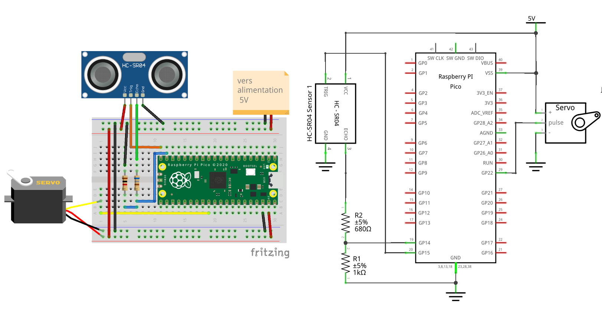

# raspberrypico-servomotor-ultrasonic-mass-storage
Servomotor controlled by ultrasonic sensor and configurable via USB Mass Storage

## Electronic board



## Build-it

```sh
git submodule update --init 
cd pico-sdk
git submodule update --init 
cd ..
mkdir build
cd build
cmake ..
make
```

## How to flash the firmware

- keep pressing on bootsel
- connect your PC to the controller and stop pressing bootsel
- the controller will be recognized as a USB storage device
- copy the file main.uf2 or test-*.uf2 on the root of this USB storage device
- the firmware is now flashed and starts/boots

## Resources

  - Slides:   https://www.overleaf.com/read/kbxggsdyydsm#3743ae
  - Pico doc: https://www.raspberrypi.com/documentation/microcontrollers/pico-series.html
  - FAT:      https://academy.cba.mit.edu/classes/networking_communications/SD/FAT.pdf
  - TinyUSB:  https://docs.tinyusb.org/en/latest/
  - USB doc:  https://www.keil.com/pack/doc/mw/USB/html/_u_s_b__descriptors.html
  - FatFS:    http://elm-chan.org/fsw/ff/ and https://github.com/abbrev/fatfs
  - inih lib: https://github.com/benhoyt/inih
